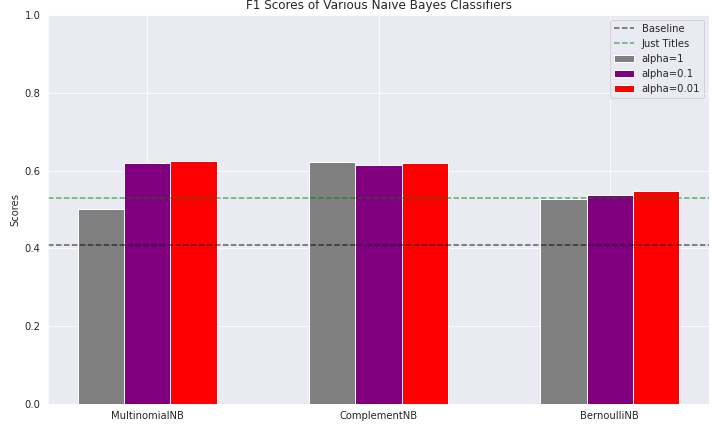

# Classifying and Measuring Language Bias in News Media

Using NLP techniques to predict news media sources' political leanings, topic model, and quantify a level of language bias. 

This project consists of three main components:
* News Website Classifier
* News Topic Modeling
* Measuring Biased Language

## Data Sources

1. Dataset of 143,000 news articles scraped from 15 American news publications. Dated 2015-2017. [Kaggle link](https://www.kaggle.com/snapcrack/all-the-news)

2. Set of 654 words (lemmatized) that were determined to commonly induce bias ([Linguistic Models for Analyzing and Detecting Biased Language](https://web.stanford.edu/~jurafsky/pubs/neutrality.pdf), Stanford NLP Research Group)

____

## News Website Classifier

I wanted to determine if - by using NLP techniques - I could create a classifier that could predict the political lean of a given news article based on its text alone. However, I first needed to generate some labels for my article text since the original dataset had no such labels.

#### MediaBiasFactCheck.com

According to its website: 

_"Media Bias/Fact Check (MBFC), founded in 2015, is an independent online media outlet. MBFC is dedicated to educating the public on media bias and deceptive news practices."_

I used political spectrum labels that the above website assigned for each of the publications in my dataset.

_Disclaimer: This project is not affiliated with any of the websites mentioned in any way, nor is it meant to reflect any political views of the author._

#### Naive Bayes Classifier

I vectorized the article text corpus using `tfidf-vectorizer` and then tested a number of Naive Bayes classification systems, attempting to predict which of the six political bias labels the article fell under.

* Left
* Left-Center
* Least Biased
* Right-Center
* Right
* Right-Extreme

Multinomial Naive Bayes with an alpha = 0.01 achieved the best F1 score (0.63) on predicting the six labels. Baseline was 0.40 due to 40% of the articles lying under the Left-Center label.

____

# Topic Modeling

I used two main approaches for unsupervised feature generation and identifying topics and subject matter for articles in the corpus.

1. __Latent Dirichlet Allocation (LDA) using Gensim__
2. Non-Negative Matrix Factorization (NMF)

Results here will only look at LDA as it proved to show more salient/distinct topics within the corpus than NMF did. However, it is worthy to note the training time for LDA was significantly longer than it was for NMF. 

| Modeling Method      | Training Time (seconds)|
| :-----------: | :-----------: |
| LDA      | 334.6       |
| NMF   | 3.6        |

Using an arbitrary value for the number of topics at 10, Gensim LDA generated the following topic model map (See flask html app for an interactive topic applet _under construction_)

___

# Quantifying Level of Bias

Stanford NLP researchers released a paper in 2013 titled "Linguistic Models for Analyzing and Detecting Biased Language". They analyzed a large set of Wikipedia edits that were made with the tag "NPOV (Neutral Point of View) issue"

Seeing as Wikipedia and other encyclopedias are meant to portray a totally neutral perspective and have as little biased language as possible, the set of words that were commonly removed/replaced by Wikipedia editors for NPOV reasons would theoretically be words in our language that commonly induced bias.

Under this mindset, I used the so-called "bias lexicon" [(link here)](https://www.cs.cornell.edu/~cristian/Biased_language.html) and quantified how many words per article in my news corpus were found in the biased words list, and grouped them by political lean:

Prior to actually measuring the number of biased words, I was hoping that the Least Biased labelled articles would possess the lowest percentage of bias, and then increasing on both sides of the spectrum respectively. However the data showed that the Right labelled articles actually had an even lower percentage than Least Biased.
___

# Conclusions

* I found that both topic and type of language used tend to influence the degree of bias found in news media texts.
* An NLP model that could accurately detect biased language would be useful for real-world editors of encyclopedias, netural news sources, etc. 
    * [Paper: Automatically Neutralizing Subjective Bias in Text](https://arxiv.org/pdf/1911.09709.pdf)
    
# Future Work

* Admittedly the methodology for quantifying the biased words was very simple.
    * Future work here involves examining context around the given word (3-grams, 5-grams) 
    * Conduct a statistical hypothesis test to generate significance levels around the differences in percentages of biased words

* Perform the same biased words analysis on the corpus of Wikipedia articles marked "Controversial"